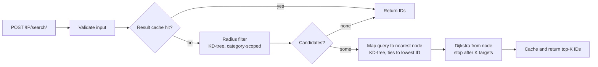

# Proximity Search

[](https://github.com/ashutosh229/proximity_search/actions/workflows/ci.yml)


A low-latency HTTP service that returns the **top-K nearest locations of a given category by road distance**. Candidates are first filtered by a Euclidean radius (KD-tree), then ranked by shortest-path distance over a road-linkage graph (Dijkstra with early termination).

---

## Table of Contents

- [Features](#features)
- [How It Works](#how-it-works)
- [Quick Start](#quick-start)
- [API Reference](#api-reference)
- [Data Formats](#data-formats)
- [Configuration](#configuration)
- [Deployment](#deployment)
- [Observability](#observability)
- [Security](#security)
- [Performance](#performance)
- [Testing and Quality](#testing-and-quality)
- [Project Structure](#project-structure)
- [Design Decisions and Limitations](#design-decisions-and-limitations)
- [Troubleshooting](#troubleshooting)
- [Contributing](#contributing)
- [License](#license)

---

## Features

- **Road-distance ranking**: results are ordered by shortest path over the linkage graph, not straight-line distance.
- **Fast candidate retrieval**: per-category KD-tree (SciPy `cKDTree`) with exact inclusive radius filtering and a brute-force fallback.
- **Single-source Dijkstra with early exit**: one traversal serves all candidates and stops after K targets are found.
- **Deterministic output**: ties are broken by ascending location ID, both for the query-to-node mapping and for result ordering.
- **Hot-reloading graphs**: linkage files are cached by `(path, mtime, size, weight mode, directedness)`; editing a file invalidates its cache entry automatically.
- **Two-level caching**: in-process LRU, with an optional shared Redis result cache that fails open.
- **Configurable semantics**: geographic or unit (grid) edge weights; undirected or directed links.
- **Production ergonomics**: multi-worker serving, health/readiness probes, Prometheus metrics (multiprocess-safe), structured access logs with request IDs, optional API-key auth, nginx rate limiting, non-root multi-stage Docker image, Kubernetes manifests, CI with dependency audit and image scan.

---

## How It Works



1. **Validate**: finite numbers, `rad >= 0`, linkage file resolved strictly inside the data directory.
2. **Cache lookup**: key is `(lat, long, category, radius, graph identity, algorithm version, K)`.
3. **Radius filter**: locations of the requested category within Euclidean distance `rad` (inclusive) of the query point.
4. **Query node**: the query coordinate is snapped to the nearest location of any category.
5. **Shortest paths**: Dijkstra from that node; candidates are accepted as they are finalized, up to K.
6. **Response**: IDs in ascending road distance. Unreachable candidates are never returned, so fewer than K IDs may come back.

---

## Quick Start

### Prerequisites

- Python 3.12+ (or Docker)
- `make` (optional)

### Local

```bash
git clone https://github.com/ashutosh229/proximity_search.git
cd proximity_search

python -m venv .venv && source .venv/bin/activate
make install          # pip install -r requirements-dev.txt
make data             # generates data/locations.csv and data/links.txt (synthetic)
make run              # http://localhost:8000
```

> The generated dataset is a synthetic 100x100 grid for local testing only. Supply your own `locations.csv` and linkage files for real use.

### Try it

```bash
curl -X POST http://localhost:8000/IP/search/ \
  -d "lat=0.5" -d "long=0.5" -d "cat=bank" -d "rad=0.3" -d "link=links.txt"
# {"locations":[4950,4949,4951,...]}
```

### Docker Compose (app + nginx)

```bash
make data
docker compose up --build
curl -X POST http://localhost/IP/search/ \
  -d "lat=0.5&long=0.5&cat=bank&rad=0.3&link=links.txt"
```

---

## API Reference

Interactive docs are served at `/docs` (Swagger UI) and `/redoc`.

### `POST /IP/search/`

Content type: `application/x-www-form-urlencoded` (form fields).

| Field  | Type   | Required | Constraints                  | Description                                       |
| ------ | ------ | -------- | ---------------------------- | ------------------------------------------------- |
| `lat`  | float  | yes      | finite                       | Query latitude                                    |
| `long` | float  | yes      | finite                       | Query longitude                                   |
| `cat`  | string | yes      | 1-64 chars, case-insensitive | Location category                                 |
| `rad`  | float  | yes      | finite, `>= 0`               | Euclidean radius, in coordinate units, inclusive  |
| `link` | string | yes      | 1-128 chars                  | Linkage file name, relative to the data directory |

Header (only when `API_KEY` is set): `x-api-key: <key>`.

**Success `200`**

```json
{ "locations": [12, 7, 31] }
```

**Errors**

| Status | Cause                                                        |
| ------ | ------------------------------------------------------------ |
| `401`  | Missing or invalid `x-api-key` (when auth is enabled)        |
| `404`  | Linkage file not found or outside the data directory         |
| `422`  | Missing, non-numeric, non-finite, or out-of-range parameters |
| `503`  | Service still starting up (data not loaded)                  |

Every response carries an `x-request-id` header (echoed from the request if provided).

### Operational endpoints

| Endpoint       | Purpose                                               |
| -------------- | ----------------------------------------------------- |
| `GET /health`  | Liveness: process is up                               |
| `GET /ready`   | Readiness: `200` once data is loaded, otherwise `503` |
| `GET /metrics` | Prometheus exposition (restrict to internal networks) |

---

## Data Formats

### `locations.csv`

Header is required; column order is flexible, names are case-insensitive.

```csv
ID,Latitude,Longitude,Category
0,0.000000,0.000000,bank
1,0.000000,0.010101,hospital
```

- `ID` is a unique integer; duplicates abort startup.
- Coordinates must be finite floats.
- Categories are trimmed and case-folded.
- Malformed rows abort startup with a line-numbered error.

### Linkage files (e.g. `links.txt`)

One link per line: two location IDs separated by whitespace or a comma.

```text
# comments and blank lines are ignored
0 1
1 2
```

Deterministic loading policy (counted in per-graph stats and logged as a warning when relevant):

| Condition            | Behavior                                     |
| -------------------- | -------------------------------------------- |
| Malformed line       | Skipped                                      |
| Unknown node ID      | Skipped                                      |
| Self-loop            | Skipped                                      |
| Duplicate link       | Collapsed, smallest weight kept              |
| Undirected (default) | Both directions stored                       |
| Directed             | `a -> b` only                                |
| Isolated location    | Valid as a query source, reaches only itself |

Validate datasets before deploying:

```bash
python scripts/validate_dataset.py data/locations.csv data/links.txt
```

---

## Configuration

All settings are environment variables.

| Variable           | Default         | Description                                                         |
| ------------------ | --------------- | ------------------------------------------------------------------- |
| `DATA_DIR`         | `data`          | Directory containing the locations file and linkage files           |
| `LOCATIONS_FILE`   | `locations.csv` | Locations CSV name inside `DATA_DIR`                                |
| `PRELOAD_LINKS`    | _(empty)_       | Comma-separated linkage files built at startup                      |
| `DEFAULT_LINK`     | _(empty)_       | Additional linkage file warmed at startup                           |
| `EDGE_WEIGHT_MODE` | `geographic`    | `geographic` (Euclidean edge length) or `grid` (every edge costs 1) |
| `DIRECTED_LINKS`   | `false`         | Treat links as one-way                                              |
| `TOP_K`            | `10`            | Maximum results per query                                           |
| `CACHE_SIZE`       | `1024`          | In-process result cache entries (`0` disables)                      |
| `GRAPH_CACHE_SIZE` | `4`             | Number of linkage graphs kept in memory                             |
| `USE_KDTREE`       | `true`          | Use KD-tree for radius filtering (`false` forces brute force)       |
| `REDIS_URL`        | _(empty)_       | Enables shared Redis result cache, e.g. `redis://redis:6379/0`      |
| `REDIS_TTL`        | `3600`          | Redis entry TTL in seconds                                          |
| `API_KEY`          | _(empty)_       | Enables `x-api-key` authentication on `/IP/search/`                 |
| `WEB_CONCURRENCY`  | `4` (image)     | Number of uvicorn worker processes                                  |
| `LOG_LEVEL`        | `INFO`          | Python log level                                                    |

> Each worker holds its own graph and in-process cache. Size memory as `workers x graph size`, or enable Redis to share results.

---

## Deployment

### Docker

The image is multi-stage, runs as a non-root user, contains only runtime dependencies, and has a built-in healthcheck against `/ready`.

```bash
docker build -t proximity-search .
docker run -d -p 8000:8000 \
  -v "$PWD/data:/srv/data:ro" \
  -e PRELOAD_LINKS=links.txt \
  -e WEB_CONCURRENCY=4 \
  proximity-search
```

### Docker Compose

`docker-compose.yml` runs the API behind nginx (`nginx.conf`) which provides:

- request rate limiting (50 r/s per IP, burst 100)
- 4 KB body limit and 5 s upstream read timeout
- `/metrics` restricted to private networks

### Kubernetes

`k8s.yaml` provides a Deployment (startup, readiness and liveness probes, resource requests and limits), a Service, and an HPA targeting 65% CPU.

```bash
kubectl apply -f k8s.yaml
```

Replace `REGISTRY/proximity-search:TAG`, mount your dataset (volume, PVC, or bake into the image), and provide `API_KEY` / `REDIS_URL` through Secrets or env as needed.

### Releasing

CI builds the image on every push, smoke-tests it, scans with Trivy, and pushes `ghcr.io/<owner>/<repo>:<sha>` from `main`.

---

## Observability

### Metrics

Exposed at `/metrics`. With multiple workers, metrics are aggregated across processes via `prometheus_client` multiprocess mode (`PROMETHEUS_MULTIPROC_DIR`, preconfigured in the image).

| Metric                                          | Type      | Meaning                                  |
| ----------------------------------------------- | --------- | ---------------------------------------- |
| `ip_requests_total`                             | counter   | Search requests                          |
| `ip_request_errors_total`                       | counter   | Requests ending in an HTTP error         |
| `ip_request_latency_seconds`                    | histogram | Search latency                           |
| `ip_cache_hits_total` / `ip_cache_misses_total` | counter   | Result cache outcomes                    |
| `ip_graph_cache_hits_total`                     | counter   | Graph cache hits                         |
| `ip_graph_builds_total`                         | counter   | Graph (re)builds                         |
| `ip_last_graph_build_seconds`                   | gauge     | Duration of the most recent graph build  |
| `ip_candidates_total`                           | counter   | Candidates produced by the radius filter |
| `ip_nodes_finalized_total`                      | counter   | Dijkstra nodes finalized                 |
| `ip_edge_relaxations_total`                     | counter   | Dijkstra edge relaxations                |
| `ip_startup_seconds`, `ip_locations_loaded`     | gauge     | Startup cost and dataset size            |
| `ip_cache_entries`                              | gauge     | Entries in the result cache              |

Suggested alerts: p95 latency, 5xx / error ratio, `/ready` failures, sustained drop in cache hit ratio, frequent `ip_graph_builds_total` increments.

### Logs

Access logs are JSON, one line per request, logger name `access`:

```json
{
  "rid": "3f2c...",
  "method": "POST",
  "path": "/IP/search/",
  "status": 200,
  "ms": 3.41
}
```

Linkage loading emits a warning with per-file counts when malformed or unknown-node lines are skipped.

---

## Security

- **Path traversal protection**: `link` is resolved strictly inside `DATA_DIR`; traversal attempts and invalid paths return `404`.
- **Authentication**: optional shared key via `API_KEY` (constant-time comparison). For multi-tenant or internet-facing use, terminate auth at your gateway.
- **Input bounds**: length limits on string fields, finite-number checks, 4 KB request body limit at nginx.
- **Least privilege**: container runs as non-root; data volume mounted read-only.
- **Supply chain**: CI runs `pip-audit` and a Trivy scan. Pin dependencies (for example `pip freeze > requirements.lock`) for reproducible builds.
- **Metrics exposure**: do not expose `/metrics` publicly.

---

## Performance

| Stage          | Technique                                                      |
| -------------- | -------------------------------------------------------------- |
| Radius filter  | Per-category `cKDTree`, exact inclusive post-filter            |
| Query-to-node  | KD-tree with deterministic tie-break (no O(N) scan)            |
| Ranking        | Single-source Dijkstra, early exit after K targets             |
| Repeat queries | LRU result cache, optional Redis                               |
| Cold start     | `PRELOAD_LINKS` builds graphs before the service reports ready |
| CPU scaling    | Multiple worker processes (GIL bypass), HPA across replicas    |

Benchmark and load test:

```bash
make bench     # radius-filter brute force vs KD-tree, plus end-to-end latency percentiles
make load      # Locust, 100 users for 60 s against http://localhost
python scripts/build_index.py links.txt   # index/graph build time and peak RSS
```

Scale guidance: pure-Python Dijkstra is comfortable up to roughly 10^5 nodes. Beyond about 10^6 nodes, move the graph to CSR arrays (`scipy.sparse.csgraph.dijkstra` with `limit`) or a compiled implementation.

---

## Testing and Quality

```bash
make test      # pytest (unit, integration, perf smoke)
make lint      # ruff
```

| Suite               | Covers                                                                                                                                |
| ------------------- | ------------------------------------------------------------------------------------------------------------------------------------- |
| `tests/unit`        | Distance and weights, linkage policies, Dijkstra correctness and tie-breaks, KD-tree vs brute force, node locator, dataset validation |
| `tests/integration` | API contract, road-vs-Euclidean ranking, topology changes, weight modes, validation errors, auth, cache, metrics                      |
| `tests/benchmark`   | Performance regression smoke test (100x100 grid)                                                                                      |

CI (`.github/workflows/ci.yml`) runs lint, dependency audit, all tests, image build with an end-to-end smoke test, a Trivy scan, and image publish on `main`.

---

## Project Structure

```text
.
├── app/
│   ├── main.py                  # app factory, lifespan, access logging, ops endpoints
│   ├── config.py                # environment-driven settings
│   ├── api/search.py            # POST /IP/search/
│   ├── core/
│   │   ├── search_engine.py     # orchestration, graph/result caching
│   │   ├── spatial_index.py     # category KD-trees, NodeLocator
│   │   ├── shortest_path.py     # Dijkstra with early termination
│   │   ├── graph.py             # adjacency-list graph
│   │   └── cache.py             # LRUCache, RedisCache
│   ├── loaders/                 # locations.csv and linkage parsers
│   ├── models/                  # Location, response schema
│   └── utils/                   # distance, Prometheus metrics
├── scripts/                     # data generation, validation, benchmark, locust, index build
├── tests/                       # unit, integration, benchmark
├── data/                        # locations.csv and linkage files (not committed)
├── Dockerfile
├── docker-compose.yml
├── nginx.conf
├── k8s.yaml
├── Makefile
└── requirements*.txt
```

---

## Design Decisions and Limitations

- **Distance units**: radius and geographic edge weights use planar Euclidean distance on raw latitude/longitude values. If your coordinates are real-world degrees and you need meters, replace `euclidean` in `app/utils/distance.py` with a haversine or projected distance, and keep the KD-tree and radius units consistent.
- **Query snapping**: the query point is routed from its nearest location node, not from a true point on a road segment.
- **Link semantics**: undirected by default; set `DIRECTED_LINKS=true` if the linkage file encodes one-way roads. The setting is part of the graph cache identity.
- **Partial results**: only reachable candidates are returned, so a result may contain fewer than K IDs.
- **Worst-case traversal**: if fewer than K candidates are reachable, Dijkstra explores the source's whole connected component.
- **Cache coherence**: the cache key includes graph identity (mtime and size) and an algorithm version. Bump `Settings.algorithm_version` when changing ranking logic.
- **Memory**: each worker process loads its own graph copy.

---

## Troubleshooting

| Symptom                                | Likely cause and fix                                                                |
| -------------------------------------- | ----------------------------------------------------------------------------------- |
| Container exits at startup             | Missing or malformed `locations.csv`, or `PRELOAD_LINKS` file not found; check logs |
| `/ready` returns `503`                 | Still loading; large graphs take longer, tune probe `failureThreshold`              |
| `404 linkage file not found`           | `link` must be a file name inside `DATA_DIR`; verify the volume mount               |
| Fewer than K results                   | Not enough category locations within `rad`, or unreachable in the graph             |
| `/metrics` counters look low           | Ensure `PROMETHEUS_MULTIPROC_DIR` is set and writable in every worker               |
| Slow first request after a data update | Linkage file changed; the graph is rebuilt once. Redeploy to pre-warm               |
| Results differ between replicas        | Different dataset versions mounted; align data and redeploy                         |

---

## Contributing

1. Fork and create a feature branch.
2. `make install && make data`.
3. Add or update tests alongside your change.
4. Run `make lint test` and make sure both pass.
5. Open a pull request describing the behavior change.

---

## License

Released under the [MIT License](LICENSE). Copyright (c) 2026 Ashutosh Kumar Jha.
